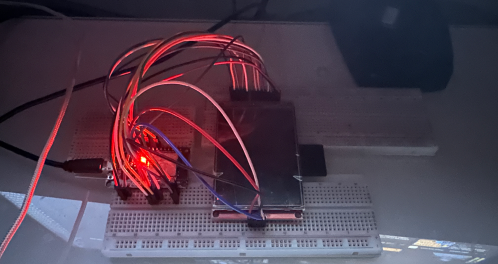

<h1 align="center"> </h1>

<p align="center"> </p>


# About

J-Frame is a compact, internet-connected video polaroid. Scan the QR code, record a video and then upload it to the frame. This repository includes everything from the hardware, firmware and webapp sources. 

# Web App

### Introduction
The J-Frame acts as an access point and hosts a HTTPS web server. Visiting the web app you can register frames, record videos and upload them to the frame. Utilizing local storage you can register a frame, disconnect, record a video, save it and then later on upload it to the J-Frame.

<center>

| Connecting and Adding frame | Recording | Converting and Uploading |
| :----:  | :----:  | :----:  | 
|      |        |        |

</center>


### Dependencies
* Node.js

### Installation
```JavaScript
// Initial Setup
cd svelte
npm install

// Development Build
npm run dev

// Production Build
npm run build
```

Running ‘npm run build’ combines all the css, js and html and minify’s it into a single index.html. There are many ways to upload to the esp32 SPIFFS, here's my recommend method: https://randomnerdtutorials.com/esp32-vs-code-platformio-spiffs/

```js
// To add a test frame uncomment lines 41 to 45 in svelte/app.svelte:

FRAMEID.set("001");
gotFrameID = true;
if(initializedDB == true){
    checkFrame($FRAMEID);
}

```

# Firmware
### Introduction
The J-Frame firmware handles everything from creating a access point, hosting a HTTPS web server and file uploading. You can upload data to SPIFFS or SD card and update the firmware all OTA. 

### Dependencies
* PlatformIO

### Installation

###  *Recommended Method*
Download the PlatformIO extensions for VSCode. You can follow the steps at: https://platformio.org/install/ide?install=vscode

### *Alternative Method*

Install PlatformIO Core: https://docs.platformio.org/en/latest/core/index.html

```cpp
// Build project
pio run

// Upload firmware
pio run --target upload
```

### HTTPS Cert
You need to generate a cert.h and private_key.h and place it in the src directory. You can follow the guide at: https://github.com/fhessel/esp32_https_server/tree/master/extras

# Hardware


### Introduction
The hardware is comprised of power/battery management, ESP32, micro SD, display and touch. You can find everything from the PCB gerber, Altium Designer files and the case models in the hardware directory.


<p align="center">
  
</p>


<center>

| Front | Back | 
| ----------- | ----------- |
|      |        |

</center>

### PCB Layout

<p align="center">
  
</p>

<p align="center">
  
</p>


### Schematic

<p align="center">
  
</p>

### Case Design

<p align="center">
  
</p>

The case is comprised of two parts. The rectangle outline on the bottom case is for a magnet. Designed in Fusion 360.

<center>

| Top | Bottom | 
| ----------- | ----------- |
|      |        |

</center>

# Prototype Hardware Setup

The recommended development setup only requires two major components, a ESP32 development board and a 3.2 inch display module.

<p align="center">

</p>

### Wiring Diagram

<p align="center">

</p>

### Bill of Materials

* [ESP32 DOIT DEV V1 module](https://www.amazon.com/HiLetgo-ESP-WROOM-32-Development-Microcontroller-Integrated/dp/B0718T232Z)
* [3.2 LCD with touch and SD reader](https://www.amazon.com/Hosyond-Display-320x240-Compatible-Development/dp/B0B1M9S9V6/ref=sr_1_5?crid=2I867KAKCLUFA&keywords=3.2%22+touch+sd+ILI9341&qid=1687163597&sprefix=3.2+touch+sd+ili9341+%2Caps%2C135&sr=8-5)
* SD card or mircoSD with adapter 
* Micro USB cable
* Breadboards and jumper cables

# Web App Design 

### Figma Design Files

You can find the Figma Design files [HERE](https://www.figma.com/file/g87cJnwRhYjOAekX3l7p9G/FRAME?type=design&node-id=93%3A3&mode=design&t=1dGgJ0la6TGdN4g0-1) including the readme design. 

<p align="center">
    
</p>

### User Flow

Once connected to the frame’s access point you’ll be able to go to jframe.cam website. The website initiates a request to the frame's webserver in order to retrieve its unique ID. The app compares this ID with all the frames stored locally, resulting in three possible outcomes:

1. If no match is found, the frame is added to the storage.
2. If a match is found but no video is associated with the frame, no action is taken.
3. If a match is found and a video is stored for the frame, the user is prompted whether they wish to upload the video.

The home screen displays a grid of all the stored frames. Clicking on a particular frame will navigate the user to the recording page. A prompt will request permission to utilize the device's cameras. Once the cameras are initialized, a live preview along with a record button will be displayed. After recording a video, it will be converted to the MJPEG format and stored on the device.
If the frame is still connected, a pop-up will appear asking whether you would like to upload the video to the frame. Notably, the web app supports offline functionality, enabling you to add a frame and record a video at any time for subsequent uploading.

# Acknowledgements 

* https://www.instructables.com/Play-Video-With-ESP32/
* https://github.com/fhessel/esp32_https_server